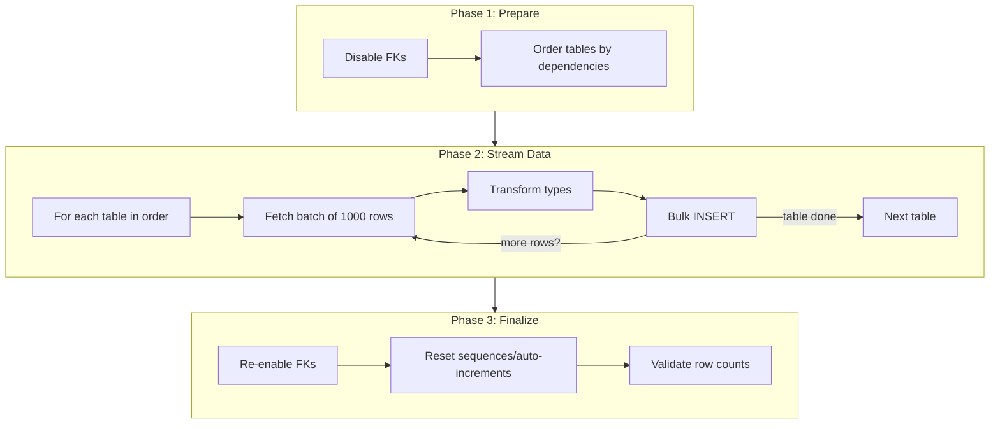

# Data Migration Flow

## Hybrid Streaming Batch Approach

## How to View This Diagram

1. **VS Code**: Install "Markdown Preview Mermaid Support" extension
2. **GitHub**: Push to GitHub and view there
3. **Online**: Copy the mermaid code to [mermaid.live](https://mermaid.live)

## Summary

| Phase | Actions |
|-------|---------|
| **Prepare** | Disable FK constraints, get table order |
| **Stream Data** | For each table: fetch 1000 rows → transform → bulk insert |
| **Finalize** | Re-enable FKs, reset sequences, validate counts |